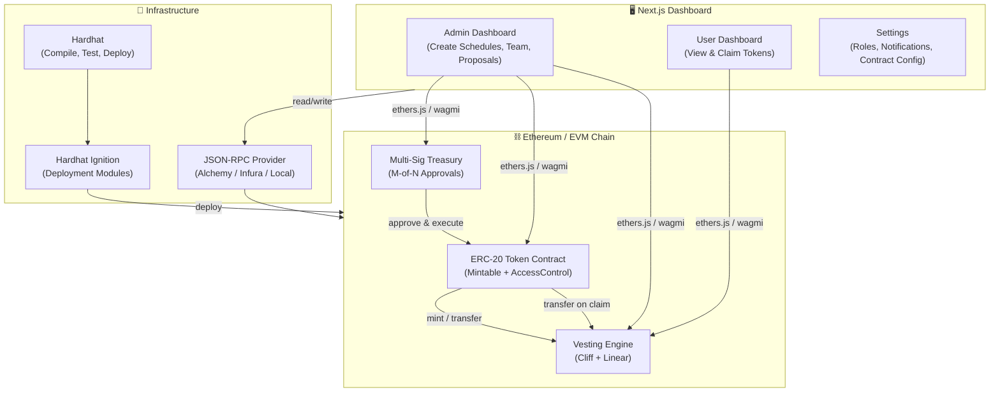
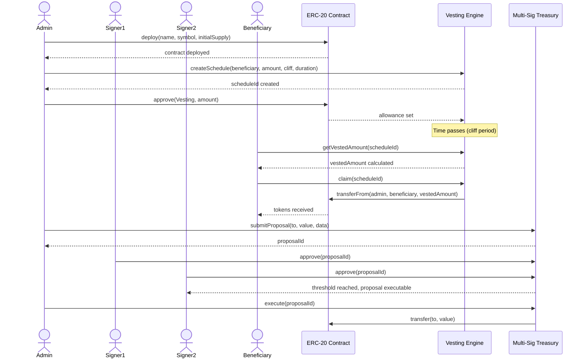
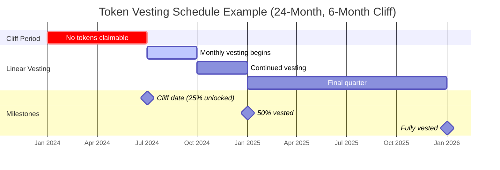
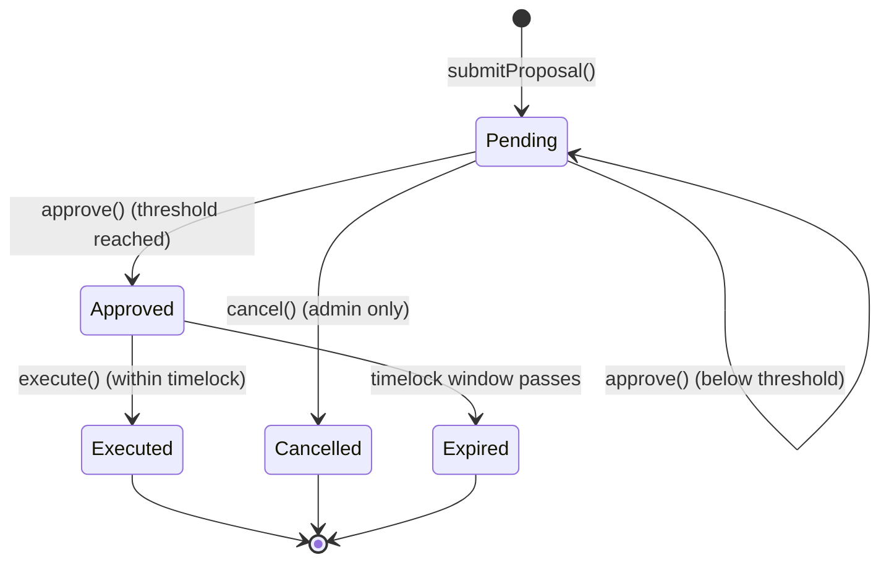
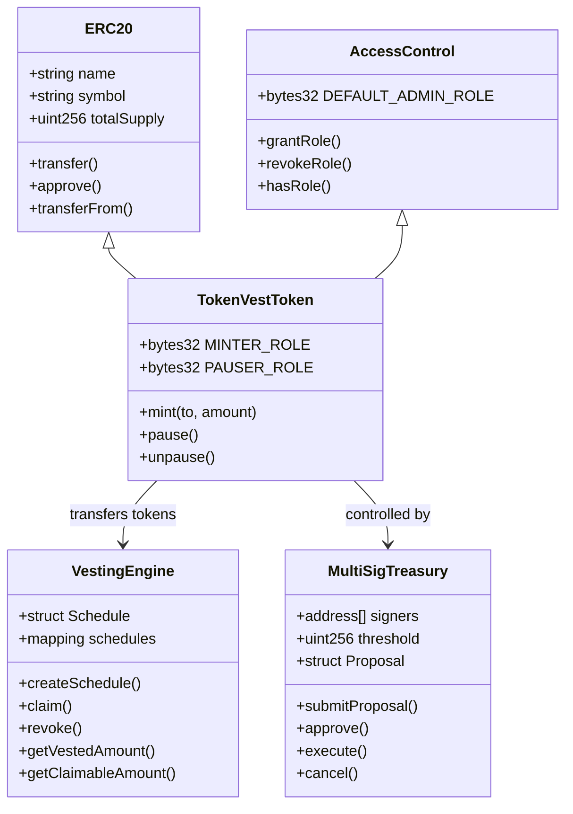
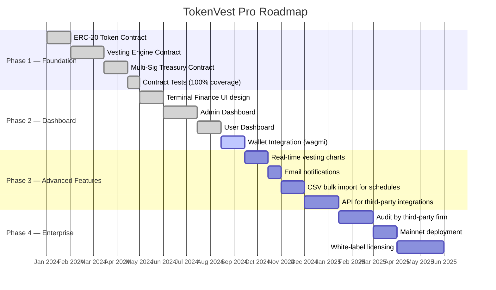

# TokenVest Pro

> Enterprise-grade token vesting and treasury management platform built on Ethereum. Issue ERC-20 tokens, automate vesting schedules, manage multi-sig treasury approvals, and give teams transparent on-chain visibility — all from a single dashboard.

<!-- PROJECT BANNER -->
<!-- Replace with your actual banner image -->
<!--  -->

<div align="center">


</div>

---

## Table of Contents

- [Overview](#overview)
- [System Architecture](#system-architecture)
- [How It Works](#how-it-works)
- [Key Features](#key-features)
- [Tech Stack](#tech-stack)
- [Project Structure](#project-structure)
- [Getting Started](#getting-started)
- [Smart Contracts](#smart-contracts)
- [Frontend](#frontend)
- [Vesting Formula](#vesting-formula)
- [Multi-Sig Treasury](#multi-sig-treasury)
- [Deployment Guide](#deployment-guide)
- [Security](#security)
- [Roadmap](#roadmap)
- [Contributing](#contributing)
- [License](#license)

---

## Overview

TokenVest Pro solves a core problem in Web3 teams: how do you distribute tokens to employees, investors, and advisors in a trustworthy, transparent, automated way — without relying on manual transfers or off-chain spreadsheets?

The platform combines five on-chain and off-chain components:

| Component | Role |
|---|---|
| **ERC-20 Token** | Mintable token with role-based access control |
| **Vesting Engine** | Cliff + linear vesting with per-beneficiary schedules |
| **Multi-Sig Treasury** | M-of-N approval flow for fund movements |
| **Admin Dashboard** | Create schedules, manage team, submit proposals |
| **User Dashboard** | Beneficiaries view and claim their vested tokens |

---

## System Architecture



---

## How It Works

### End-to-End Token Lifecycle



---

## Vesting Timeline



---

## Multi-Sig Approval Flow



---

## Smart Contract Class Diagram



---

## Key Features

### Token Management
- **Mintable ERC-20** with role-based minting (only `MINTER_ROLE` can mint)
- **Pausable** transfers for emergency scenarios
- **AccessControl** — granular role assignment (Admin, Minter, Pauser)

### Vesting Engine
- **Cliff + linear vesting** — tokens locked until cliff date, then released linearly
- **Per-beneficiary schedules** — each team member gets independent parameters
- **Revocable** — admin can revoke unvested tokens back to treasury
- **Claim anytime** — beneficiaries call `claim()` to pull vested tokens on-demand
- **Transparent** — all schedules and amounts visible on-chain

### Multi-Sig Treasury
- **M-of-N approval** — define how many signers must approve before execution
- **Proposal-based** — all fund movements require an on-chain proposal
- **Timelock** — proposals can only execute within a defined window after approval
- **Audit trail** — every approval, rejection, and execution logged as events

### Admin Dashboard
- Create and manage vesting schedules visually
- Add/remove team members with wallet addresses
- Submit and track treasury proposals
- Role management (grant/revoke contract roles)

### User Dashboard
- View personal vesting schedule and progress
- See cliff date, vesting duration, and total allocation
- One-click token claim
- Transaction history

---

## Tech Stack

| Layer | Technology | Purpose |
|---|---|---|
| Smart Contracts | Solidity 0.8.28 | Core business logic on-chain |
| Contract Framework | Hardhat 2.x | Compile, test, deploy |
| Contract Library | OpenZeppelin 5.x | ERC-20, AccessControl, SafeERC20 |
| Deployment | Hardhat Ignition | Reproducible deployment modules |
| Frontend Framework | Next.js 16 (App Router) | React SSR + client pages |
| Language | TypeScript 5.x | Type safety across the stack |
| Styling | Tailwind CSS + CSS Variables | Terminal Finance design system |
| UI Primitives | Radix UI | Accessible modals, dropdowns, dialogs |
| Icons | Lucide React | Consistent icon set |
| Web3 Connection | ethers.js / wagmi | Contract interaction + wallet connect |
| Package Manager | pnpm | Workspace management |
| Node Version | 20.x LTS | Runtime |

---

## Project Structure

```
token-vesting/
├── contracts/                    # Solidity smart contracts
│   ├── TokenVestToken.sol        # ERC-20 with AccessControl + Pausable
│   ├── VestingEngine.sol         # Cliff + linear vesting logic
│   └── MultiSigTreasury.sol      # M-of-N multi-sig treasury
│
├── ignition/                     # Hardhat Ignition deployment modules
│   └── modules/
│       └── TokenVesting.ts       # Deployment sequence + config
│
├── test/                         # Contract test suite
│   ├── TokenVestToken.test.ts
│   ├── VestingEngine.test.ts
│   └── MultiSigTreasury.test.ts
│
├── scripts/                      # Utility scripts
│   └── deploy.ts                 # Manual deploy helper
│
├── frontend/                     # Next.js 16 dashboard
│   ├── src/
│   │   ├── app/                  # App Router pages
│   │   │   ├── page.tsx          # Landing page
│   │   │   ├── dashboard/        # Admin overview
│   │   │   ├── vesting/          # Vesting schedule management
│   │   │   ├── treasury/         # Proposal & fund management
│   │   │   ├── team/             # Team member management
│   │   │   └── settings/         # App configuration
│   │   ├── components/
│   │   │   ├── ui/               # Base UI components
│   │   │   │   ├── Button.tsx
│   │   │   │   ├── Card.tsx
│   │   │   │   ├── Input.tsx
│   │   │   │   ├── Modal.tsx
│   │   │   │   ├── Toast.tsx
│   │   │   │   ├── Dropdown.tsx
│   │   │   │   ├── Select.tsx
│   │   │   │   ├── Badge.tsx
│   │   │   │   └── Progress.tsx
│   │   │   ├── layout/
│   │   │   │   └── Sidebar.tsx   # Sidebar + Header + MainLayout
│   │   │   └── landing/
│   │   │       └── Landing.tsx   # All landing page sections
│   │   ├── fonts/                # Local PlusJakartaSans .woff2 files
│   │   └── lib/
│   │       └── utils.ts          # cn() helper
│   ├── next.config.ts
│   └── package.json
│
├── hardhat.config.ts             # Hardhat + network configuration
├── package.json                  # Root workspace package
└── README.md
```

---

## Getting Started

### Prerequisites

- **Node.js** 20.x LTS
- **pnpm** 8.x or later (`npm install -g pnpm`)
- **Git**
- A wallet with testnet ETH (for deployment)
- An RPC URL from [Alchemy](https://alchemy.com) or [Infura](https://infura.io)

### 1. Clone the Repository

```bash
git clone https://github.com/your-org/token-vesting.git
cd token-vesting
```

### 2. Install Dependencies

```bash
# Install all workspace dependencies
pnpm install
```

### 3. Environment Setup

```bash
# Copy environment template
cp .env.example .env
```

Edit `.env`:

```env
# Deployment
PRIVATE_KEY=your_deployer_wallet_private_key
ALCHEMY_API_KEY=your_alchemy_api_key
ETHERSCAN_API_KEY=your_etherscan_api_key

# Network RPC URLs
SEPOLIA_RPC_URL=https://eth-sepolia.alchemyapi.io/v2/YOUR_KEY
MAINNET_RPC_URL=https://eth-mainnet.alchemyapi.io/v2/YOUR_KEY

# Frontend
NEXT_PUBLIC_CHAIN_ID=11155111
NEXT_PUBLIC_CONTRACT_ADDRESS=0x...
NEXT_PUBLIC_VESTING_ADDRESS=0x...
NEXT_PUBLIC_TREASURY_ADDRESS=0x...
```

### 4. Compile Contracts

```bash
npx hardhat compile
```

### 5. Run Contract Tests

```bash
npx hardhat test

# With gas report
REPORT_GAS=true npx hardhat test
```

### 6. Start Local Hardhat Node

```bash
# Terminal 1 — start local chain
npx hardhat node

# Terminal 2 — deploy to local node
npx hardhat ignition deploy ./ignition/modules/TokenVesting.ts --network localhost
```

### 7. Run the Frontend

```bash
cd frontend
pnpm dev
```

Open [http://localhost:3000](http://localhost:3000).

---

## Smart Contracts

### TokenVestToken.sol

ERC-20 token with:
- `MINTER_ROLE` — allows designated addresses to mint new tokens
- `PAUSER_ROLE` — allows pausing all token transfers
- `DEFAULT_ADMIN_ROLE` — can grant/revoke all roles

```solidity
// Mint tokens (requires MINTER_ROLE)
token.mint(beneficiary, amount);

// Pause transfers (requires PAUSER_ROLE)
token.pause();
```

### VestingEngine.sol

Manages vesting schedules. Core formula:

```
vestedAmount = totalAmount × (elapsed - cliff) / (duration - cliff)
claimable = vestedAmount - alreadyClaimed
```

Key functions:

```solidity
// Create a new vesting schedule
vesting.createSchedule(
    beneficiary,   // address
    totalAmount,   // uint256 (wei)
    startTime,     // uint256 (unix timestamp)
    cliffDuration, // uint256 (seconds)
    vestDuration   // uint256 (seconds)
);

// Beneficiary claims their vested tokens
vesting.claim(scheduleId);

// Admin revokes a schedule (unvested tokens return to admin)
vesting.revoke(scheduleId);
```

### MultiSigTreasury.sol

M-of-N multi-signature treasury:

```solidity
// Submit a proposal
uint256 proposalId = treasury.submitProposal(
    to,     // address
    value,  // uint256 (wei)
    data    // bytes (calldata for contract interaction, or empty for ETH transfer)
);

// Signers approve
treasury.approve(proposalId);

// Execute after threshold is reached
treasury.execute(proposalId);
```

---

## Vesting Formula

The vesting calculation uses cliff + linear release:

```
If currentTime < startTime + cliff:
    vestedAmount = 0

Else if currentTime >= startTime + vestingDuration:
    vestedAmount = totalAllocation

Else:
    elapsed = currentTime - (startTime + cliff)
    vestingPeriod = vestingDuration - cliff
    vestedAmount = totalAllocation × elapsed / vestingPeriod

claimableNow = vestedAmount - previouslyClaimed
```

**Example:**
- Total: 100,000 tokens
- Start: Jan 1, 2024
- Cliff: 6 months (Jul 1, 2024)
- Duration: 24 months (Jan 1, 2026)

| Date | Vested | Claimable |
|---|---|---|
| Apr 1, 2024 | 0 | 0 (cliff not reached) |
| Jul 1, 2024 | 0 | 0 (cliff just reached, linear starts) |
| Oct 1, 2024 | ~16,667 | ~16,667 |
| Jan 1, 2025 | 33,333 | 33,333 |
| Jan 1, 2026 | 100,000 | 100,000 (fully vested) |

---

## Multi-Sig Treasury

The treasury requires M signatures from a defined set of N signers before any proposal executes.

**Setup example:**

```solidity
address[] memory signers = [alice, bob, carol, dave];
uint256 threshold = 3; // 3-of-4 required

MultiSigTreasury treasury = new MultiSigTreasury(signers, threshold);
```

**Proposal lifecycle:**

1. Any signer calls `submitProposal(to, value, data)`
2. Each signer independently calls `approve(proposalId)`
3. Once `threshold` approvals collected → proposal is `Approved`
4. Any signer calls `execute(proposalId)` within the timelock window
5. Treasury sends ETH or calls the target contract

---

## Screenshots

> Replace the placeholder blocks below with actual screenshots of your running app.

### Landing Page
<!-- Add screenshot: docs/images/landing.png -->
```
[ Screenshot: Landing page hero section ]
```

### Admin Dashboard
<!-- Add screenshot: docs/images/dashboard.png -->
```
[ Screenshot: Dashboard overview with stats and charts ]
```

### Vesting Management
<!-- Add screenshot: docs/images/vesting.png -->
```
[ Screenshot: Vesting schedules table with progress bars ]
```

### Treasury Proposals
<!-- Add screenshot: docs/images/treasury.png -->
```
[ Screenshot: Treasury proposal list with voting status ]
```

### Team Management
<!-- Add screenshot: docs/images/team.png -->
```
[ Screenshot: Team members list with allocation details ]
```

**To add screenshots:**
1. Take a screenshot of your running app
2. Save to `docs/images/` (create this folder)
3. Replace the placeholder blocks above with: ``

---

## Deployment Guide

### Testnet (Sepolia)

```bash
# Compile contracts
npx hardhat compile

# Deploy to Sepolia
npx hardhat ignition deploy ./ignition/modules/TokenVesting.ts \
  --network sepolia \
  --verify
```

This deploys all three contracts in sequence and verifies on Etherscan.

### Mainnet

```bash
npx hardhat ignition deploy ./ignition/modules/TokenVesting.ts \
  --network mainnet \
  --verify
```

> **Warning:** Always audit contracts before mainnet deployment. Use a hardware wallet for the deployer key.

### Frontend on Vercel

1. Push your repository to GitHub
2. Import project at [vercel.com/new](https://vercel.com/new)
3. Set **Root Directory** to `frontend`
4. Add all `NEXT_PUBLIC_*` environment variables from your `.env`
5. Deploy

### Frontend on Self-Hosted

```bash
cd frontend
pnpm build
pnpm start
```

Or use the Docker approach:

```dockerfile
FROM node:20-alpine
WORKDIR /app
COPY frontend/package.json frontend/pnpm-lock.yaml ./
RUN npm install -g pnpm && pnpm install --frozen-lockfile
COPY frontend/ .
RUN pnpm build
EXPOSE 3000
CMD ["pnpm", "start"]
```

---

## Security

| Concern | Mitigation |
|---|---|
| Reentrancy on `claim()` | Update state (claimed amount) before external token transfer |
| Role escalation | `DEFAULT_ADMIN_ROLE` required to grant any role; multi-sig controls admin |
| Overflow | Solidity 0.8.x built-in overflow checks; OpenZeppelin SafeERC20 |
| Private key exposure | `.env` in `.gitignore`; use hardware wallet for production deploy |
| Front-running vesting claim | Claim amount is deterministic on-chain; MEV impact is minimal |
| Multi-sig collusion | Threshold set at least 51% of signer count |
| Paused token | Pause is a break-glass; single PAUSER_ROLE address should be a cold wallet |

---

## Roadmap



---

## Contributing

1. Fork the repository
2. Create a feature branch: `git checkout -b feature/my-feature`
3. Make your changes and add tests
4. Ensure all tests pass: `npx hardhat test`
5. Lint the frontend: `cd frontend && pnpm lint`
6. Submit a pull request with a clear description

### Code Style

- Solidity: follow [Solidity Style Guide](https://docs.soliditylang.org/en/latest/style-guide.html)
- TypeScript: Prettier + ESLint (config in `frontend/.eslintrc.json`)
- Commit messages: `type(scope): description` (e.g. `feat(vesting): add partial revoke`)

---

## License

MIT License — see [LICENSE](LICENSE) for details.

---

<div align="center">
  <p>Built with Hardhat, OpenZeppelin, and Next.js</p>
  <p>
    <a href="https://hardhat.org">Hardhat</a> ·
    <a href="https://openzeppelin.com">OpenZeppelin</a> ·
    <a href="https://nextjs.org">Next.js</a>
  </p>
</div>
